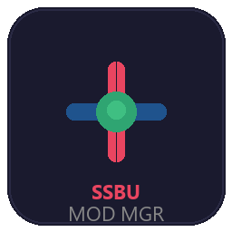

# SSBU Mod Manager

A full-featured desktop application for managing Super Smash Bros. Ultimate mods on Nintendo Switch emulators. Built with Python and customtkinter.



## Features

### Mod Management
- **Enable/Disable Mods** — Toggle mods on and off with a single click (moves disabled mods outside the mods folder so ARCropolis/LayeredFS won't load them)
- **Enable/Disable All** — Bulk-toggle all mods with confirmation dialogs
- **Category Detection** — Mods are automatically categorized by content type (Character, Audio, Stage, UI, Effect, etc.)
- **Grouping & Filtering** — Group mods by category, filter by status, and search by name
- **Fix Nested Folders** — Auto-detect and flatten unnecessarily nested mod subfolders
- **Undo/Redo** — All mod actions support undo (Ctrl+Z) and redo (Ctrl+Y)

### CSS Editor
- **1-Click Add Character** — Auto-detects `name_id`, `fighter_kind`, costumes, announcer voice, and display name from mod folders
- **Generate Custom CSS Template** — Automatically build a CSS mod containing only characters with installed mods
- **Alphabetical Ordering** — Custom characters are sorted alphabetically on the CSS grid
- **Auto-Detect & Hide Unused** — Syncs CSS entries with currently installed mods
- **Manual Editing** — Edit any PRC field directly: `ui_chara_id`, `fighter_kind`, `name_id`, `disp_order`, costume indices, announcer labels

### Plugin Management
- **Enable/Disable Plugins** — Manage ARCropolis, HDR, and other Skyline plugins
- **Enable/Disable All** — Bulk-toggle with automatic protection for required plugins (e.g., ARCropolis)
- **Known Plugin Info** — Displays descriptions and links for recognized plugins

### Music Management
- **3-Column Layout** — Stages on the left, playlist in the middle, available tracks on the right
- **Audio Preview** — Play WAV, OGG, MP3, NUS3AUDIO (LOPUS, OPUS, IDSP, BWAV), and FLAC tracks directly in the app. Uses ffmpeg for high-fidelity NUS3AUDIO decoding when available, with robust manual fallback parser supporting non-aligned sections, JUNK padding, big/little-endian frame sizes, LOPUS sub-header detection, and TOC-byte validation. Automatically converts OGG Opus to WAV via ffmpeg when needed. Click any track while music is playing to auto-switch playback
- **Volume & Seek** — Adjustable volume slider and seek timeline for playback
- **Stage Playlists** — Assign tracks to specific stages with drag-to-reorder
- **Main Menu Music** — Change the main menu background music by assigning a track to the "Main Menu" stage entry
- **Competitive Stages Filter** — Filter stage list to show only tournament-legal stages (Battlefield, Small Battlefield, Final Destination, Smashville, Town and City, Pokemon Stadium 2, Kalos Pokemon League, Hollow Bastion, Northern Cave, Yoshi's Story)
- **Bulk Operations** — Assign all tracks to all stages, clear all assignments
- **Auto Track Name Detection** — Automatically extracts track names from both XMSBT and binary MSBT files, including extended tracklist mods
- **Beautified Track Names** — Raw BGM filenames like `bgm_sonic_adventure__mechanical_resonance` are automatically transformed into readable names like "Mechanical Resonance [Sonic Adventure]" using 100+ franchise mappings
- **Auto MSBT Overlay Generation** — Extracts custom text entries from binary MSBT files and generates XMSBT (XML overlay) files in `_MergedResources`. This ensures custom track names, character names, and other text additions from mods are visible in-game even when the emulator's LayeredFS can't reliably load binary MSBT replacements. Entries from multiple mods are merged (union). Locale-specific MSBT files (e.g. `msg_bgm+us_en.msbt`) are automatically renamed to locale-independent names (e.g. `msg_bgm.msbt`) so ARCropolis uses them as universal fallbacks. Legacy stale binary MSBT copies are automatically cleaned up to prevent ARCropolis conflicts (Error 2-0069). Original mod files are never moved or deleted
- **Save** — Generates PRC configuration for in-game music (use the global Save button in the toolbar)

### Conflict Detection & Resolution
- **Automatic Scanning** — Detects when multiple mods modify the same game file
- **Type-Based Grouping** — Conflicts grouped by file type (XMSBT, MSBT, PRC, STPRM, STDAT) with explanations
- **Auto-Merge** — XMSBT text conflicts are merged using a union strategy (all labels from all mods combined); overlapping labels use last-mod-wins
- **MSBT-to-XMSBT Overlay Generation** — Automatically extracts custom text entries from binary MSBT files across all mods and generates merged XMSBT (XML overlay) files in `_MergedResources`. Entries from multiple mods are merged (union). Binary MSBTs are fully converted to XML overlays regardless of whether one or many mods provide them. Stale binary copies are automatically cleaned up to prevent ARCropolis duplicate conflicts (Error 2-0069). The generated `config.json` includes proper `new-dir-infos` entries so ARCropolis recognizes all overlay directories. Original mod files are never moved or modified
- **ARCropolis Config** — Automatically creates `config.json` in `_MergedResources` so ARCropolis recognizes it as a valid mod
- **Restore Originals** — One-click undo of all merges: restores any previously moved files to their mod folders and cleans up `_MergedResources`
- **Startup Auto-Restore** — On launch, automatically restores any files that were moved by previous versions, ensuring mod integrity
- **Backup Before Merge** — Configurable automatic backup creation before any merge or resolution operation
- **Manual Resolution** — Choose which mod's version to keep for non-mergeable conflicts

### Emulator Migration
- **Emulator-to-Emulator Migration** — Migrate all SSBU data (mods, plugins, saves, etc.) between supported emulators with one click
- **Smart Scanning** — Detects installed emulators and scans their SSBU data (mods, plugins, Skyline framework, RomFS/ExeFS overrides, save data, NAND system files)
- **Selective Migration** — Choose exactly which data categories to migrate (mods, plugins, saves, etc.)
- **Direct Export / Import** — Export your entire SSBU setup (SDMC + extended data like encryption keys, firmware, profiles, NAND content) directly from our app — no emulator GUI required. Import seamlessly with auto-detection of export format
- **Extended Data Support** — Exports emulator-specific data beyond SDMC: encryption keys, registered content, user profiles, game load mods, NAND system files
- **Legacy Import** — Supports importing from both the new direct export format and legacy emulator-exported folders
- **LDN Network Awareness** — Reminds users that different emulators run separate online multiplayer networks and rooms are NOT cross-compatible
- **Version Upgrade Tool** — Upgrade to a new version of the same emulator while preserving all settings, config, keys, shader cache, save data, and mods. Supports auto-detection of existing installs and per-category selective migration with preview

### Online Compatibility
- **Compatibility Code Checker** — Tournament-ready system: host generates a compact compatibility code, players paste it to instantly verify their gameplay mods match. Intelligently distinguishes between desync-causing files (PRC params, stage collision, gameplay plugins, ExeFS patches) and safe cosmetic differences (textures, models, audio, UI skins, effects)
- **Optional Plugin Awareness** — Recognizes ~18 known optional plugins (less-lag, input display, CSS managers, replay, etc.) that don't affect gameplay sync. Shows setup differences as informational rather than incompatible
- **Tournament Workflow** — TO generates code → shares in Discord/lobby → players check before starting matches
- **Detailed Mismatch Report** — When incompatible, shows exactly which gameplay files differ, grouped by category (missing mods, extra mods, mismatched files, plugin differences)
- **Mod Sync Guide** — In-app reference explaining which mods both players need for online play vs. which are client-side only
- **Automatic Mod Analysis** — Categorizes your enabled mods by online impact: gameplay mods (both need), visual/audio mods (client-side only), custom stages (shared if selected)
- **Shareable Summary** — Generates a copyable text summary of your mod setup to share with friends so they know what to install

### Profile Sharing
- **Export/Import** — Share your mod setup as a portable profile code
- **Profile Codes** — Compact base64-encoded strings representing your mod configuration

### Additional Features
- **Multi-Emulator Support** — Works with Eden, Ryujinx, Yuzu, Suyu, Sudachi, Citron, and others
- **Auto-Detection** — Automatically finds your emulator's SDMC path on startup
- **Developer Mode** — Built-in debug logging with search, auto-scroll, and clipboard support
- **Zoom / Scaling** — Ctrl+Plus and Ctrl+Minus to zoom the entire UI in/out (60%–200%), Ctrl+0 to reset; persisted across sessions
- **Scaling-Aware Window** — Window geometry and minimum size scale proportionally with UI zoom and display scaling, ensuring nothing is cut off at higher DPI settings
- **Resizable Panels** — Drag the splitter handles between columns on the Music and CSS Editor pages to resize panes
- **Smooth UI** — Resize debouncing, proper cleanup, and consistent dark theme
- **Lazy Page Loading** — Pages are created on first navigation for fast startup
- **Lazy Audio Init** — Pygame mixer initializes only when audio is first played, not at startup
- **Fast Scrolling** — 5x scroll speed multiplier across all scrollable widgets, automatically re-applied on page navigation and dynamic content changes
- **Non-Blocking Audio** — Audio playback runs in a background thread so the UI never freezes during NUS3AUDIO conversion
- **Global Save / Discard** — Save and Discard buttons right-aligned in the toolbar header (alongside Undo/Redo). Save is bright green when active, Discard is grey. Both buttons are visually shaded out when there's nothing to save. Ctrl+S to save
- **Unsaved Changes Warning** — Prompts before closing the application if you have unsaved music or CSS changes
- **Auto-Save Settings** — Settings are saved automatically when changed, with debounced writes to prevent excessive disk I/O
- **Atomic Config Writes** — Settings are written atomically (temp file + rename) to prevent corruption from crashes

## Screenshots

The application features a modern dark theme with sidebar navigation:

- **Dashboard** — Overview stats, quick actions, and conflict status
- **Mods** — Category-grouped mod list with toggle switches
- **Music** — 3-column resizable layout for stage music assignment
- **Conflicts** — Type-grouped conflict display with explanations
- **Settings** — Emulator path configuration and preferences

## Requirements

- Python 3.10+
- Windows (primary platform)

### Python Dependencies

| Package | Purpose |
|---------|---------|
| [customtkinter](https://pypi.org/project/customtkinter/) | Dark-themed GUI framework |
| [pyprc](https://pypi.org/project/pyprc/) | Reading/writing `.prc` param files |
| [pylibms](https://pypi.org/project/pylibms/) | Reading/writing `.msbt` message files |
| [Pillow](https://pypi.org/project/Pillow/) | Image processing for icons |
| [pygame](https://pypi.org/project/pygame/) | Audio playback for music preview |

### Optional Dependencies

| Package | Purpose |
|---------|---------|
| [ffmpeg](https://ffmpeg.org/) | Required for previewing OGG Opus audio (NUS3AUDIO LOPUS tracks). Install from [ffmpeg.org](https://ffmpeg.org/download.html) or via `choco install ffmpeg` / `winget install ffmpeg` |

### Additional Files

- **ParamLabels.csv** — Hash-to-string label mapping (~3 MB, not included in repo). Download from [param-labels](https://github.com/ultimate-research/param-labels) and place in the project root.

## Installation

### From Source

```bash
# Clone the repo
git clone https://github.com/your-username/ssbu-mod-manager.git
cd ssbu-mod-manager

# Create virtual environment
python -m venv .venv
.venv\Scripts\activate

# Install dependencies
pip install -r requirements.txt

# Download ParamLabels.csv (place in project root)
# https://github.com/ultimate-research/param-labels

# Run
python main.py
```

### Standalone Executable

Download `SSBUModManager.exe` from the [Releases](../../releases) page. No Python installation required.

## Building the Executable

```bash
# Install dependencies (includes PyInstaller)
pip install -r requirements.txt

# Build
python build.py
```

The executable will be in the `dist/` folder.

## Usage

1. **First Launch** — Go to Settings and configure your emulator's SDMC path, or let the app auto-detect it
2. **Manage Mods** — Navigate to the Mods page to enable/disable mods with toggle switches
3. **Edit CSS** — Use the CSS Editor to add custom characters to the character select screen
4. **Manage Music** — Assign custom music tracks to stages in the Music page
5. **Check Conflicts** — Visit the Conflicts page to detect and resolve file conflicts between mods
6. **Share Setup** — Export your mod configuration as a profile code on the Profiles page
7. **Migrate Emulators** — Use Migration to copy your SSBU data between emulators (e.g., Ryujinx → Eden)
8. **Check Online Compatibility** — Visit the Online Guide to see which mods both players need for multiplayer

## Project Structure

```
ssbu-mod-manager/
├── main.py                         # Entry point
├── build.py                        # PyInstaller build script
├── requirements.txt                # Python dependencies
├── ParamLabels.csv                 # Hash labels (download separately)
├── assets/
│   ├── icon.ico                    # Application icon
│   └── logo.png                    # Logo image
├── src/
│   ├── app.py                      # Main application class
│   ├── config.py                   # Settings persistence
│   ├── constants.py                # Game constants (stages, fighters)
│   ├── paths.py                    # Emulator path detection
│   ├── core/
│   │   ├── compat_checker.py       # Online compatibility code system
│   │   ├── conflict_detector.py    # File conflict detection
│   │   ├── conflict_resolver.py    # Conflict resolution & merging
│   │   ├── css_manager.py          # CSS database management
│   │   ├── emulator_migrator.py    # Emulator-to-emulator migration
│   │   ├── file_scanner.py         # Mod file scanning
│   │   ├── mod_manager.py          # Mod enable/disable logic
│   │   ├── msbt_handler.py         # MSBT message file handling
│   │   ├── music_manager.py        # Music track & playlist management
│   │   ├── plugin_manager.py       # Plugin management
│   │   ├── prc_handler.py          # PRC param file handling
│   │   └── share_code.py           # Profile export/import
│   ├── models/
│   │   ├── character.py            # Character data model
│   │   ├── conflict.py             # Conflict & resolution models
│   │   ├── mod.py                  # Mod data model
│   │   ├── music.py                # Music track model
│   │   ├── plugin.py               # Plugin data model
│   │   ├── profile.py              # Profile data model
│   │   └── settings.py             # App settings model
│   ├── ui/
│   │   ├── base_page.py            # Base class for all pages
│   │   ├── main_window.py          # Main window with toolbar
│   │   ├── sidebar.py              # Navigation sidebar
│   │   ├── pages/
│   │   │   ├── conflicts_page.py   # Conflict detection & resolution
│   │   │   ├── css_page.py         # CSS editor page
│   │   │   ├── dashboard_page.py   # Dashboard overview
│   │   │   ├── developer_page.py   # Developer debug log
│   │   │   ├── mods_page.py        # Mod management page
│   │   │   ├── migration_page.py   # Emulator migration page
│   │   │   ├── music_page.py       # Music management page
│   │   │   ├── online_compat_page.py # Online compatibility guide
│   │   │   ├── plugins_page.py     # Plugin management page
│   │   │   ├── settings_page.py    # Settings configuration
│   │   │   └── share_page.py       # Profile sharing page
│   │   └── widgets/
│   │       ├── conflict_card.py    # Conflict display card
│   │       ├── mod_card.py         # Mod display card
│   │       ├── music_track_row.py  # Music track row widget
│   │       ├── plugin_row.py       # Plugin display row
│   │       ├── search_bar.py       # Search input widget
│   │       ├── status_bar.py       # Bottom status bar
│   │       └── toggle_switch.py    # Toggle switch widget
│   └── utils/
│       ├── action_history.py       # Undo/redo system
│       ├── audio_player.py         # Audio playback (pygame)
│       ├── file_utils.py           # File operation utilities
│       ├── hashing.py              # PRC hash resolution
│       ├── logger.py               # In-memory debug logger
│       ├── nus3audio.py            # NUS3AUDIO container parser (LOPUS/OPUS/IDSP/BWAV)
│       ├── resource_path.py        # PyInstaller resource paths
│       └── xmsbt_parser.py         # XMSBT text file parser
└── tests/                          # Test files
```

## How It Works

- **PRC (`ui_chara_db.prc`)** — The character database. Each entry defines a CSS slot with fields like `ui_chara_id`, `fighter_kind`, `name_id`, `disp_order`, costume indices, and announcer voice labels.
- **MSBT (`msg_name.msbt`)** — The display name text file. Labels like `nam_chr1_00_{name_id}` map to character names shown on screen.
- **XMSBT (`.xmsbt`)** — Text override files used by mods. When multiple mods have XMSBT files for the same path, they can be merged automatically.
- **MSBT-to-XMSBT Conversion** — Some mods ship binary `.msbt` files (full replacements). The tool extracts custom text entries from all binary MSBTs across all mods, merges them (union), and generates XMSBT (XML overlay) files in `_MergedResources`. This ensures custom song titles, character names, and other text additions from mods appear in-game. Stale binary copies are automatically cleaned up.
- **Mod Detection** — The tool reads `config.json`, portrait filenames, `.xmsbt` text files, and narration sound files from each mod folder to auto-detect properties.
- **Conflict Detection** — Scans all enabled mods for files at the same relative path. Groups conflicts by type and offers resolution strategies.

## Keyboard Shortcuts

| Shortcut | Action |
|----------|--------|
| Ctrl+Z | Undo last action |
| Ctrl+Y | Redo last undone action |
| Ctrl+S | Save changes |
| Ctrl+Plus | Zoom in (increase UI scale by 10%) |
| Ctrl+Minus | Zoom out (decrease UI scale by 10%) |
| Ctrl+0 | Reset zoom to 100% |

## License

MIT
